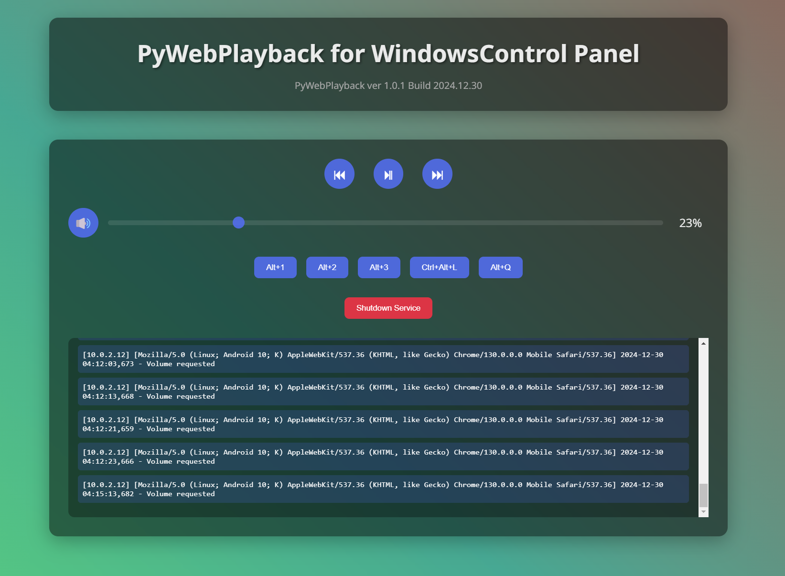

# PyWebPlayback - Web-based Windows Media Controller

## Overview
PyWebPlayback is a Flask web application that allows remote control of Windows system volume and media playback through any web browser. Features a modern Apple-style interface with real-time controls and responsive design.

## Features
- 🎵 Real-time volume control
- ⏯️ Media playback controls (play/pause, next, previous)
- 🖥️ Cross-device control support 
- 🎨 Modern UI with animations
- 📱 Mobile-friendly design
- 🔄 Real-time status updates
- 📝 System logging
- ⌨️ Custom shortcut support

## Tech Stack
- **Backend**: Flask, Python 3.6+
- **Audio Control**: pycaw, comtypes
- **System Integration**: win32api
- **Frontend**: HTML5, CSS3, JavaScript

## Installation

### Requirements
- Windows 10/11
- Python 3.6 or higher
- Modern web browser

### Quick Start
```bash
# Clone repository
git clone https://gitee.com/amazoncloud/py-web-playback.git

# Install dependencies
pip install -r requirements.txt

# Run application
python PyWebPlayback.py
```

## Usage

### Access Methods
- Local: http://localhost:80/
- Network: http://[your-ip]:80/

### Controls
1. **Volume Control**
   - Slider for precise adjustment
   - Mute toggle button
   - Real-time feedback

2. **Media Controls**  
   - Play/Pause toggle
   - Next/Previous track
   - Visual status indicators

3. **Shortcut Keys**
   - Alt+1, Alt+2, Alt+3
   - Ctrl+Alt+L
   - Alt+Q (Quick exit)

## Development

### Project Structure
```
PyWebPlayback/
├── PyWebPlayback.py      # Main application
├── requirements.txt      # Dependencies
└── README.md            # Documentation
```

### Core Components

1. **Volume Control**
```python
@app.route('/volume', methods=['POST'])
def set_volume():
    volume = request.json.get('volume', 0)
    # Set system volume using pycaw
```

2. **Media Control**
```python
@app.route('/playback', methods=['POST'])
def control_playback():
    action = request.json.get('action', '')
    # Control media using win32api
```

### Configuration
```json
{
    "baseport": 80,
    "listenaddress": "0.0.0.0",
    "debug": false
}
```

## Troubleshooting

### Common Issues

1. **Service Won't Start**
   - Check port availability
   - Verify Python installation
   - Run as administrator if needed

2. **Volume Control Issues**
   - Reinstall pycaw
   - Check audio device
   - Verify COM components

3. **Media Keys Not Working**
   - Check media player compatibility
   - Verify win32api installation
   - Check system shortcuts

## Security Notes
- Local network only
- No authentication required
- Safe system API usage

## Contributing
1. Fork repository
2. Create feature branch
3. Commit changes
4. Push to branch
5. Submit Pull Request

## License
MIT License

## Author
Gitee: Volkath@amazoncloud

## Version History

### v1.0.1 (2024.12.30)
- Added logging system
- UI improvements
- Error handling
- Configuration file support

### v1.0.0 (2024.12.29)
- Initial release
- Basic functionality
- Web interface

## Acknowledgments
- Flask framework
- pycaw library
- win32api
- comtypes

---
**Note**: For personal use only. Not for commercial purposes.