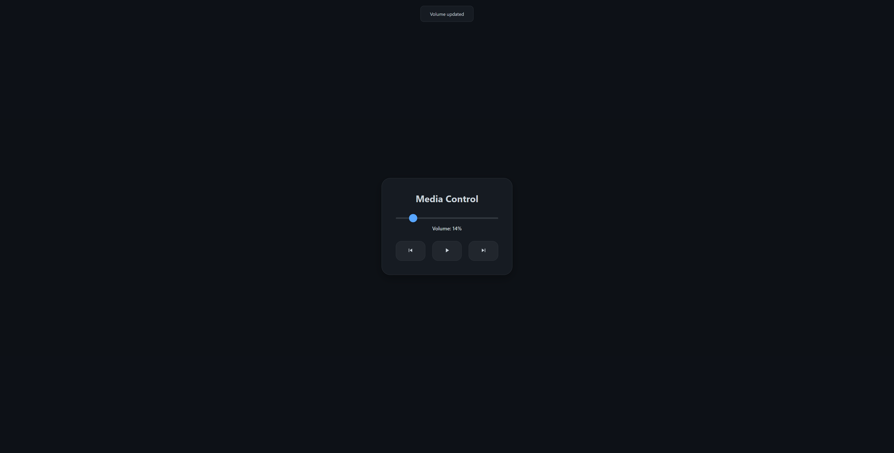
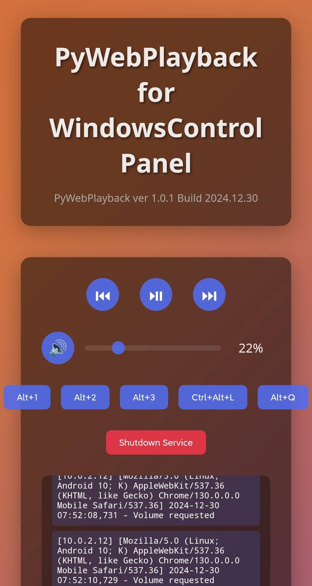

# PyWebPlayback - 基于Web的Windows媒体控制器

## 目录
1. [项目简介](#项目简介)
2. [主要功能](#主要功能)
3. [技术架构](#技术架构)
4. [安装指南](#安装指南)
5. [使用说明](#使用说明)
6. [开发文档](#开发文档)
7. [常见问题](#常见问题)
8. [更新日志](#更新日志)

## 项目简介
PyWebPlayback 是一个基于 Flask 的网页应用程序，允许用户通过浏览器远程控制 Windows 系统的媒体播放和音量。项目采用了现代化的 Apple 风格设计，提供了流畅的动画效果和响应式界面，特别适合在躺床上或远离电脑时控制媒体播放。

### 设计理念
- 简约美观的用户界面
- 跨设备兼容性
- 实时响应控制
- 安全可靠的本地运行

## 主要功能

### 1. 音量控制
- 实时音量调节（0-100%）
- 静音切换
- 音量数值显示
- 滑块可视化控制

### 2. 媒体控制
- 播放/暂停切换
- 上一曲/下一曲
- 播放状态指示
- 媒体键模拟

### 3. 快捷键支持
- Alt+1、Alt+2、Alt+3 快捷键
- Ctrl+Alt+L 组合键
- Alt+Q 快捷退出

### 4. 系统功能
- 服务状态监控
- 运行日志记录
- 优雅关闭服务

## 技术架构

### 后端技术
- **Web框架**: Flask
- **音频控制**: pycaw
- **系统交互**: win32api, comtypes
- **进程管理**: threading, queue

### 前端技术
- **界面设计**: HTML5, CSS3
- **交互控制**: JavaScript
- **动画效果**: CSS Animations
- **实时通信**: Fetch API

### 系统架构
```text
PyWebPlayback
├── 后端服务层
│   ├── Flask 路由控制
│   ├── 音频设备管理
│   ├── 系统快捷键
│   └── 日志记录
│
├── 前端展示层
│   ├── 控制面板
│   ├── 音量调节
│   ├── 媒体控制
│   └── 状态显示
│
└── 系统集成层
    ├── COM 组件
    ├── 音频接口
    └── 键盘模拟
```

## 安装指南

### 系统要求
- Windows 10/11
- Python 3.6+
- 现代浏览器（Chrome/Edge/Firefox）

### 依赖安装
```bash
# 克隆仓库
git clone https://gitee.com/amazoncloud/py-web-playback.git

# 安装依赖
pip install -r requirements.txt
```

### 配置说明
```json
{
    "baseport": 80,
    "listenaddress": "0.0.0.0",
    "debug": false
}
```

## 使用说明

### 1. 启动服务
```bash
python PyWebPlayback.py
```
服务启动后会自动打开默认浏览器，访问控制面板。

### 2. 访问方式
- 本机访问：http://localhost:80/
- 局域网访问：http://[本机IP]:80/

### 3. 界面操作
- 音量控制：拖动滑块或点击音量图标
- 媒体控制：使用播放控制按钮
- 快捷键：点击对应快捷键按钮
- 系统控制：点击关闭服务按钮

## 开发文档

### 项目结构
```
PyWebPlayback/
├── PyWebPlayback.py      # 主程序
├── requirements.txt      # 依赖清单
└── README.md            # 说明文档
```

### 核心模块

#### 1. 音频控制模块
```python
def set_volume():
    pythoncom.CoInitialize()
    try:
        devices = AudioUtilities.GetSpeakers()
        interface = devices.Activate(
            IAudioEndpointVolume._iid_, CLSCTX_ALL, None)
        volume_interface = cast(interface, POINTER(IAudioEndpointVolume))
        volume_interface.SetMasterVolumeLevelScalar(volume/100, None)
        return jsonify({'status': 'success'})
    finally:
        pythoncom.CoUninitialize()
```

#### 2. 媒体控制模块
```python
def control_playback():
    VK_MEDIA_PLAY_PAUSE = 0xB3
    VK_MEDIA_NEXT_TRACK = 0xB0
    VK_MEDIA_PREV_TRACK = 0xB1
    
    if action == 'playpause':
        win32api.keybd_event(VK_MEDIA_PLAY_PAUSE, 0, 0, 0)
        win32api.keybd_event(VK_MEDIA_PLAY_PAUSE, 0, win32con.KEYEVENTF_KEYUP, 0)
```

#### 3. 日志系统
```python
class QueueHandler(logging.Handler):
    def emit(self, record):
        log_entry = {
            'message': self.format(record),
            'type': record.levelname.lower()
        }
        try:
            log_queue.put_nowait(log_entry)
        except queue.Full:
            pass
```

### API 接口

#### 1. 音量控制
- GET `/get_volume`: 获取当前音量
- POST `/volume`: 设置系统音量

#### 2. 媒体控制
- POST `/playback`: 控制媒体播放
  - action: playpause/next/previous

#### 3. 快捷键
- POST `/shortcut`: 发送系统快捷键
  - shortcut: alt1/alt2/alt3/ctrlaltl/altq

#### 4. 系统控制
- POST `/shutdown`: 关闭服务

## 常见问题

### 1. 服务无法启动
- 检查端口占用
- 确认管理员权限
- 验证 Python 环境

### 2. 音量控制失效
- 重新安装 pycaw
- 检查音频设备
- 确认 COM 组件状态

### 3. 媒体控制无响应
- 验证媒体播放器兼容性
- 检查系统快捷键
- 确认 win32api 权限

## 安全说明

### 1. 网络安全
- 仅支持局域网访问
- 无需身份验证
- 建议修改默认端口

### 2. 系统安全
- 使用系统API
- 无需管理员权限
- 安全的进程管理

## 更新日志

### v1.0.1 (2024.12.30)
- 优化界面设计
- 添加日志系统
- 完善错误处理
- 增加配置文件

### v1.0.0 (2024.12.29)
- 首次发布
- 基础功能实现
- 界面框架搭建

## 致谢
感谢以下开源项目的支持：
- Flask
- pycaw
- win32api
- comtypes

## 许可证
本项目采用 MIT 许可证

## 作者
Gitee: Volkath@amazoncloud

---

## 参考资料
1. Flask 官方文档
2. pycaw 使用指南
3. Windows API 参考
4. JavaScript 媒体控制

## 联系方式
- Gitee: @amazoncloud
- Email: [your-email@example.com]

注意：本项目仅供学习和个人使用，请勿用于商业目的。